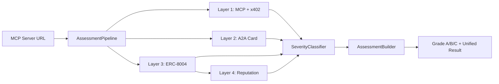

[]() 

# MCP Agent Assessment

Unified MCP Agent Assessment: orchestrates MCP validation, A2A agent card checks, ERC-8004 on-chain verification, and reputation queries into a single structured assessment with severity classification and compare support.

## What is an Agent?

In the context of this module, an **Agent** is an MCP server endpoint that exposes capabilities across up to four protocol layers:

1. **MCP Server** — Provides tools, resources, and prompts via the Model Context Protocol
2. **A2A Agent Card** — Publishes an agent card following Google's Agent-to-Agent protocol
3. **ERC-8004 Registration** — Has an on-chain identity via the ERC-8004 agent registry
4. **On-Chain Reputation** — Carries verifiable reputation data on-chain

An Agent is not limited to a single protocol. This module assesses the full spectrum of capabilities an endpoint offers, from basic MCP compliance to on-chain identity and reputation. The term "Agent" reflects that modern MCP servers increasingly act as autonomous service providers with identity, payment capabilities (x402), and cross-protocol interoperability.

## Description

This module provides a comprehensive 4-layer assessment pipeline for MCP agents. It validates protocol compliance, payment capabilities, agent card structure, on-chain registration, and reputation data. Results are classified by severity (ERROR, WARNING, INFO) and graded (A/B/C) for quick health evaluation.

The assessment covers:
- **Layer 1**: MCP protocol validation and x402 payment requirements (via `x402-mcp-validator`)
- **Layer 2**: A2A agent card structure and capabilities (via `a2a-agent-validator`)
- **Layer 3**: ERC-8004 on-chain registration verification (via `erc8004-registry-parser`)
- **Layer 4**: On-chain reputation data queries

## Quickstart

Install and run a basic assessment:

```bash
git clone https://github.com/FlowMCP/mcp-agent-assessment.git
cd mcp-agent-assessment
npm install
```

```javascript
import { McpAgentAssessment } from 'mcp-agent-assessment'

const result = await McpAgentAssessment.assess( {
    endpoint: 'https://mcp.example.com/sse',
    timeout: 15000
} )

console.log( `Grade: ${result.entries.assessment.grade}` )
console.log( `Healthy: ${result.categories.overallHealthy}` )
console.log( `Supports x402: ${result.categories.supportsX402}` )
```

## Features

- 4-layer assessment pipeline (MCP, A2A, ERC-8004, Reputation)
- Severity classification with 3 levels (ERROR, WARNING, INFO)
- Grading system (A/B/C) based on error and warning counts
- 22 unified boolean category flags
- Snapshot comparison with per-layer diffs
- Parallel execution of independent layers
- Configurable timeout per layer

## Architecture

The assessment pipeline orchestrates four independent validators into a unified result:



## Table of Contents

- [Methods](#methods)
  - [.assess()](#assess)
  - [.compare()](#compare)
- [Severity System](#severity-system)
- [4-Layer Pipeline](#4-layer-pipeline)
- [Categories Reference](#categories-reference)
- [Contribution](#contribution)
- [License](#license)

## Methods

The module exports a single class `McpAgentAssessment` with two static methods for assessing MCP servers and comparing assessment results.

### .assess()

Performs a complete 4-layer assessment of an MCP server endpoint. Returns structured data with severity-classified messages, boolean capability flags, grading, and raw layer results.

**Method**
```javascript
.assess( { endpoint, timeout, erc8004 } )
```

**Parameters**
| Key | Type | Description | Required |
|-----|------|-------------|----------|
| endpoint | string | MCP server endpoint URL | Yes |
| timeout | number | Request timeout in milliseconds. Default `15000` | No |
| erc8004 | object or null | ERC-8004 config with `rpcNodes` map (chain alias to RPC URL). Default `null` | No |

**Example**
```javascript
import { McpAgentAssessment } from 'mcp-agent-assessment'

const result = await McpAgentAssessment.assess( {
    endpoint: 'https://mcp.example.com/sse',
    timeout: 15000,
    erc8004: {
        rpcNodes: {
            'ETHEREUM_MAINNET': 'https://eth-mainnet.g.alchemy.com/v2/YOUR_KEY',
            'BASE_MAINNET': 'https://base-mainnet.g.alchemy.com/v2/YOUR_KEY'
        }
    }
} )

console.log( `Grade: ${result.entries.assessment.grade}` )
console.log( `Errors: ${result.entries.assessment.errorCount}` )
console.log( `Warnings: ${result.entries.assessment.warningCount}` )
```

**Returns**
```javascript
returns {
    status: true,
    messages: [
        {
            code: 'PRB-001',
            severity: 'INFO',
            layer: 1,
            location: 'tools',
            message: 'PRB-001 tools: Found 3 tools'
        }
    ],
    categories: { /* 22 boolean flags */ },
    entries: {
        endpoint: 'https://mcp.example.com/sse',
        timestamp: '2026-02-07T10:30:00.000Z',
        mcp: { /* Layer 1 data */ },
        a2a: { /* Layer 2 data */ } | null,
        erc8004: { /* Layer 3 data */ } | null,
        reputation: { /* Layer 4 data */ } | null,
        assessment: {
            errorCount: 0,
            warningCount: 0,
            infoCount: 1,
            grade: 'A'
        }
    },
    layers: {
        mcp: { /* raw Layer 1 result */ },
        a2a: { /* raw Layer 2 result */ },
        erc8004: null,
        reputation: null
    }
}
```

| Key | Type | Description |
|-----|------|-------------|
| status | boolean | `true` if no ERROR severity messages |
| messages | array | Classified message objects with code, severity, layer, location, message |
| categories | object | 22 boolean capability flags across all 4 layers |
| entries | object | Structured data: endpoint, timestamp, mcp, a2a, erc8004, reputation, assessment |
| layers | object | Raw results from each layer (mcp, a2a, erc8004, reputation) |

### .compare()

Compares two assessment results and returns a detailed diff showing changes across all layers. Delegates to layer-specific comparators for MCP and A2A data.

**Method**
```javascript
.compare( { before, after } )
```

**Parameters**
| Key | Type | Description | Required |
|-----|------|-------------|----------|
| before | object | Previous `assess()` result | Yes |
| after | object | Subsequent `assess()` result | Yes |

**Example**
```javascript
import { McpAgentAssessment } from 'mcp-agent-assessment'

const resultA = await McpAgentAssessment.assess( { endpoint: 'https://mcp.example.com/sse' } )
// ... changes happen on the server ...
const resultB = await McpAgentAssessment.assess( { endpoint: 'https://mcp.example.com/sse' } )

const diff = McpAgentAssessment.compare( { before: resultA, after: resultB } )

console.log( `Has changes: ${diff.hasChanges}` )
console.log( `Grade changed: ${diff.diff.assessment.grade.before} → ${diff.diff.assessment.grade.after}` )
```

**Returns**
```javascript
returns {
    status: true,
    messages: [],
    hasChanges: true,
    diff: {
        mcp: { /* delegated to McpServerValidator.compare() */ },
        a2a: { /* delegated to A2aAgentValidator.compare() */ },
        erc8004: {
            registration: { changed: {} },
            categories: { changed: {} }
        } | null,
        reputation: { changed: {} } | null,
        assessment: {
            grade: { before: 'B', after: 'A' },
            errorCount: { before: 0, after: 0 },
            warningCount: { before: 2, after: 0 },
            categories: {
                changed: {
                    supportsX402: { before: false, after: true }
                }
            }
        }
    }
}
```

| Key | Type | Description |
|-----|------|-------------|
| status | boolean | Always `true` on success |
| messages | array | Integrity warnings (e.g. endpoint mismatch) |
| hasChanges | boolean | `true` if any differences detected |
| diff | object | Per-layer diff: mcp, a2a, erc8004, reputation, assessment |

## Severity System

Every diagnostic message is classified into 3 severity levels that determine the overall grade:

| Level | Impact | Example |
|-------|--------|---------|
| ERROR | Blocks grade A/B | Connection failures, invalid payment requirements |
| WARNING | Blocks grade A | Missing optional fields, spec deviations |
| INFO | No impact | Discovered tools, detected capabilities |

### Error Code Prefixes

Error codes follow the pattern `{PREFIX}-{NUMBER}`:

| Prefix | Scope |
|--------|-------|
| `CON-*` | Connection/protocol issues |
| `PAY-*` | Payment requirement issues (x402) |
| `PRB-*` | Probe informational messages |
| `CSV-*` | Agent card validation issues (A2A) |
| `VAL-*` | General validation issues |
| `REG-*` | Registration issues (ERC-8004) |
| `RPC-*` | RPC node issues |
| `REP-*` | Reputation data issues |

### Grading

| Grade | Condition |
|-------|-----------|
| A | No errors and no warnings |
| B | No errors but has warnings |
| C | Has errors |

## 4-Layer Pipeline

The assessment runs through four layers, with dependencies between them:

| Layer | Protocol | Source | Required |
|-------|----------|--------|----------|
| 1 | MCP + x402 | `x402-mcp-validator` | Always |
| 2 | A2A Agent Card | `a2a-agent-validator` | Always |
| 3 | ERC-8004 | `.well-known/agent-registration.json` + on-chain | Only if `erc8004` param provided |
| 4 | Reputation | On-chain `getMetadata()` | Only if Layer 3 finds agentId |

**Execution:**
- Layers 1 and 2 run in parallel
- Layer 3 depends on configuration (`erc8004` parameter)
- Layer 4 depends on Layer 3 results (requires agentId)

## Categories Reference

The assessment returns 22 boolean flags categorizing server capabilities:

### Layer 1 (MCP + x402)

| Flag | Description |
|------|-------------|
| isReachable | Server responds to requests |
| supportsMcp | Valid MCP protocol handshake |
| hasTools | Server exposes tools |
| hasResources | Server exposes resources |
| hasPrompts | Server exposes prompts |
| supportsX402 | At least one tool has x402 payment |
| hasValidPaymentRequirements | Payment requirements pass validation |
| supportsExactScheme | Uses exact payment scheme |
| supportsEvm | Supports EVM networks |
| supportsSolana | Supports Solana networks |
| supportsTasks | Supports MCP task capabilities |
| supportsMcpApps | Supports MCP Apps protocol |

### Layer 2 (A2A)

| Flag | Description |
|------|-------------|
| hasA2aCard | A2A agent card found |
| hasA2aValidStructure | Agent card has valid structure |
| hasA2aSkills | Agent card declares skills |
| supportsA2aStreaming | Agent supports streaming |

### Layer 3 (ERC-8004)

| Flag | Description |
|------|-------------|
| hasWellKnownRegistration | `.well-known/agent-registration.json` found |
| hasErc8004Registration | On-chain registration exists |
| isErc8004OnChainVerified | On-chain ownership verified |
| isErc8004SpecCompliant | Registration follows ERC-8004 spec |

### Layer 4 (Reputation)

| Flag | Description |
|------|-------------|
| hasOnChainReputation | On-chain reputation data exists |

### Overall

| Flag | Description |
|------|-------------|
| overallHealthy | No ERROR messages across all layers |

## Validation Codes

The assessment pipeline classifies every message with a severity (ERROR, WARNING, INFO) based on the `SeverityClassifier`.

### ASM — Assessment Input Validation

| Code | Severity | Description |
|------|----------|-------------|
| ASM-001 | ERROR | endpoint: Missing value |
| ASM-002 | ERROR | endpoint: Must be a string |
| ASM-003 | ERROR | endpoint: Must not be empty |
| ASM-004 | ERROR | endpoint: Must be a valid URL |
| ASM-005 | ERROR | timeout: Must be a number |
| ASM-006 | ERROR | timeout: Must be greater than 0 |
| ASM-010 | ERROR | erc8004: Must be an object |
| ASM-011 | ERROR | erc8004.rpcNodes: Missing value |
| ASM-012 | ERROR | erc8004.rpcNodes: Must be an object |
| ASM-013 | ERROR | erc8004.rpcNodes: Must have at least one entry |
| ASM-014 | ERROR | erc8004.rpcNodes: Key must be a non-empty string |
| ASM-015 | ERROR | erc8004.rpcNodes: Value must be a non-empty string |
| ASM-016 | ERROR | erc8004.rpcNodes: Must be a valid URL |
| ASM-020 | ERROR | before: Missing value |
| ASM-021 | ERROR | before: Must be an object |
| ASM-022 | ERROR | before: Missing categories or entries |
| ASM-023 | ERROR | after: Missing value |
| ASM-024 | ERROR | after: Must be an object |
| ASM-025 | ERROR | after: Missing categories or entries |

### REG — ERC-8004 Registry

| Code | Severity | Description |
|------|----------|-------------|
| REG-001 | INFO | well-known: File not found or not reachable |
| REG-002 | WARNING | well-known: Response is not valid JSON |
| REG-003 | WARNING | well-known: Missing or invalid "registrations" array |
| REG-020 | WARNING | agentId: Missing required field |
| REG-021 | WARNING | agentRegistry: Missing required field |
| REG-022 | WARNING | chainId: Missing or unknown chain identifier |
| REG-030 | WARNING | spec: Validation issue in on-chain data |

### RPC — On-Chain RPC

| Code | Severity | Description |
|------|----------|-------------|
| RPC-001 | ERROR | rpcNodes: No RPC node configured for chain |
| RPC-002 | ERROR | eth_call: RPC call failed |
| RPC-003 | WARNING | registry: Agent not found in on-chain registry |
| RPC-010 | ERROR | reputation: RPC call failed |

### REP — Reputation

| Code | Severity | Description |
|------|----------|-------------|
| REP-001 | INFO | No reputation data found |

### CON — Connection (Layer 1 / Layer 5)

| Code | Severity | Description |
|------|----------|-------------|
| CON-001 | ERROR | endpoint: Server is not reachable |

### CMP — Comparison

| Code | Severity | Description |
|------|----------|-------------|
| CMP-001 | WARNING | Endpoints differ between snapshots |
| CMP-002 | WARNING | Before snapshot missing timestamp |
| CMP-003 | WARNING | After snapshot is older than before snapshot |

## Contribution

PRs are welcome! Please ensure:
- All public methods have tests
- Coverage remains above 70%
- Code follows formatting standards (4 spaces, no semicolons, spaces inside brackets)
- Commit messages reference issue numbers

## License

MIT
